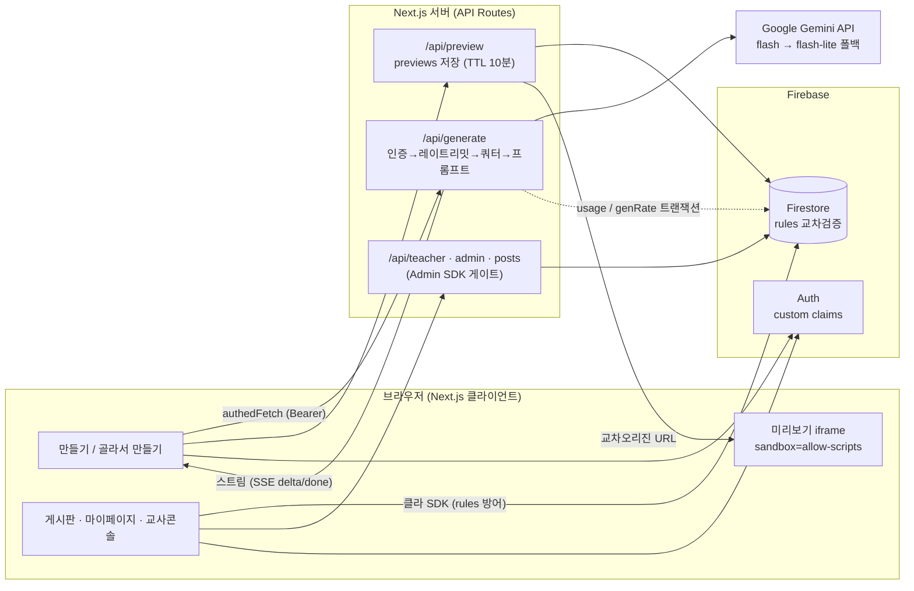
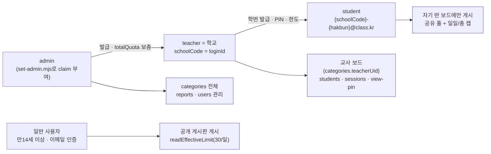
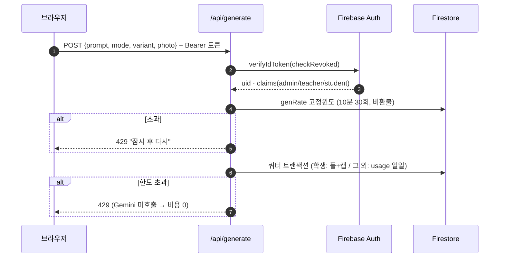
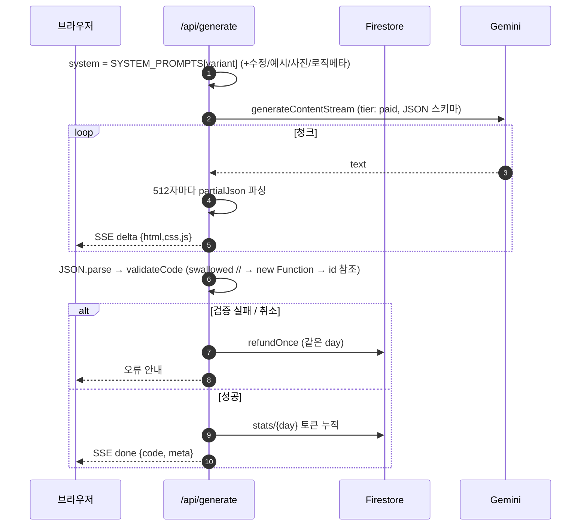
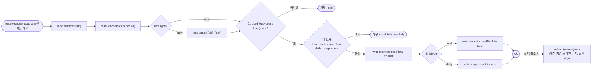
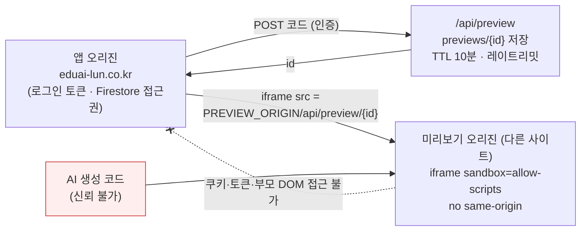

# LUN — 프로그램 전체 구조 및 핵심 알고리즘

> 작성 2026-09-01 · 코드 실물 기준(app 53 · components 56 · lib 86 파일). 기능이 바뀌면 이 문서도 함께 갱신할 것.

---

## 1. 개요 · 기술 스택

**LUN(Logic Unfold Next)** — 초등 저학년이 코드 없이 **한글 계획(서술) 또는 선택지(설문)** 로 프로그램을 설계하면, AI(Gemini)가 실제 HTML/CSS/JS를 생성해 미리보기·수정·저장·게시판 공유까지 하는 교육용 웹 서비스.

| 층 | 기술 |
|---|---|
| 프런트/서버 | **Next.js 15 (App Router)**, React, TypeScript, Tailwind v4(OKLCH 토큰) |
| 데이터/인증 | **Firebase** — Auth(custom claims), Firestore(rules·복합인덱스), App Check(reCAPTCHA v3) |
| AI | **Google Gemini API** (`gemini-2.5-flash` → `flash-lite` 폴백), JSON 스키마 모드, 스트리밍 |
| 배포/운영 | Vercel(Next), Firebase(rules/indexes), GitHub Actions(자동예시·의존성감사), cron 엔드포인트 |
| 검열 | korcen(한국어 비속어) + 자체 보강 목록 |

---

## 2. 디렉터리 구조 (역할별)

```
app/                      # 라우트(App Router)
  page.tsx                #   랜딩
  create/  easy/  board/  #   만들기 · 골라서 만들기 · 게시판
  mypage/  teacher/  admin/**   # 내정보 · 교사 콘솔 · 관리자
  share/[postId]/         #   관람 PIN 공유 뷰
  privacy/ terms/ about/  #   법적 문서·소개
  api/
    generate/             #   ★ AI 생성 (서버 전용, 키 보호)
    preview/**            #   격리 미리보기 저장/서빙
    posts/[id]/**         #   게시물 삭제·카운터(좋아요·조회·포크)
    teacher/**  student/  admin/**   # 역할별 API
    share/[postId]        #   관람 PIN 검증
    cron/                 #   daily-stats · generate-examples · cleanup-previews
    beacon/ me/           #   방문 비콘 · 내 정보/사용량
components/
  creator/   # 만들기 화면(Creator, ResultPanel, PhotoUpload)
  survey/    # 골라서 만들기(SurveyWizard, StepScreen)
  board/     # 게시판(BoardView, PostList, PostPreview, UploadDialog, ShareDialog)
  auth/      # AuthProvider(클레임·세션), LoginDialog
  teacher/ admin/ edu/ common/ ui/ fx/ landing/
lib/
  ai/        # ★ 어댑터 경계: types · provider(교체점) · gemini · prompts · validateCode · partialJson
  survey/    # 설문 엔진: types · assemble · programs/*(12종)
  server/    # Admin SDK 전용: studentQuota · genRate · rateLimit · deleteAccount · ownedStudent
  firebase/  # 클라 SDK: client · posts(페이지네이션) · categories · users · likes/views
  edu/       # detectConcepts · concepts(도감)
  examples/  # 자동 예시: randomPlan · generateExampleOnce · publishExample
  client/    # authedFetch · session · sound · generate · downloadZip
  moderation.ts   # 검열
  admin/ board/ creator/ student/ teacher/
firestore.rules · firestore.indexes.json   # 보안 규칙·복합 인덱스
scripts/   # set-admin, selftest-*(미커밋 일회성)
```

---

## 3. 전체 아키텍처 · 데이터 흐름

```
[브라우저]                          [Next.js 서버(API)]                 [외부]
 계획서/설문 ─authedFetch─▶ /api/generate ─▶ 인증·레이트리밋·쿼터 ─▶ Gemini(스트림)
 ◀─ SSE 스트림(delta/done) ◀─ partialJson 파싱 · validateCode ◀──────┘
 미리보기 ─▶ /api/preview(저장, TTL 10분) ─▶ 교차오리진 iframe(sandbox)
 게시판 ─클라 Firestore SDK(rules 방어)─▶ posts / categories / users
 카운터·삭제·신고 ─▶ /api/posts · teacher · admin (Admin SDK)
```



**설계 원칙**
- **AI 어댑터 경계**: 앱은 `lib/ai/types.ts`의 계약(`GenerateInput → GeneratedCode`)만 알고, 제공자 교체점은 `lib/ai/provider.ts` 한 곳. Gemini 세부(모델·JSON 모드·폴백·재시도)는 `gemini.ts`에 캡슐화.
- **AI 호출은 서버만**(`/api/generate`) — 키 노출 방지. 시스템 프롬프트는 클라 입력을 무시하고 서버가 `variant` 키로 선택(프롬프트 주입 차단).
- **쓰기 경로 이원화**: 게시물 생성/수정은 클라 SDK + `firestore.rules`(1차 방어), 카운터·삭제·역할 관리는 Admin SDK API(서버 게이트).

---

## 4. 데이터 모델 (Firestore 컬렉션 지도)

| 컬렉션 | 접근 | 내용 |
|---|---|---|
| `posts` | 공개 읽기 / 본인·admin 쓰기 | 작품(코드 3필드, plan, 교육 메타, boardTeacherUid, photo) |
| `categories` | 공개 읽기 / admin | 게시판(교사보드는 `teacherUid`) |
| `users` · `nicknames` | 공개 읽기 | 닉네임 + 유일성 점유 문서 |
| `schools` | 공개 | 학교코드(=교사 loginId, 학생 로그인 드롭다운 소스) |
| `teachers` · `students` · `sessions` · `reports` | 본인/admin | 교사 풀(totalQuota/usedTotal), 학생(hakbun·limit), 세션 토큰, 신고 |
| `usage` · `limits` · `exemplars` · `previews` · `config` · `stats` · `genRate` | **Admin SDK 전용** | 일일 카운터, 한도 오버라이드, 참고예시, 미리보기, 설정, 통계, 레이트리밋 |

**역할(Auth custom claim)**: `admin`(scripts/set-admin) → `teacher`(=학교, admin 발급) → `student`(교사 발급). 발급형 계정은 가짜 `@class.kr` 이메일이라 `email_verified` 면제(`isRoleAccount`).



---

## 5. 핵심 알고리즘

### 5.1 AI 생성 파이프라인 — `app/api/generate/route.ts`
```
1 인증    Bearer ID토큰 → verifyIdToken(checkRevoked) → 클레임(admin/teacher/student)·emailVerified
2 입력    mode(generate|modify) · variant(default|survey) · prompt · photo(data-URI ≤350KB)
3 레이트  allowGenerate(uid) — 10분 고정윈도 30회, 비환불 (abort-파밍 상한)
4 쿼터    학생: reserveStudentQuota(공유풀+캡, 한 트랜잭션)
          교사/admin: ROLE_DAILY_LIMIT(100) · 일반: readEffectiveLimit(30, config·per-user)
          → usage/{uid}_{day}(KST) 트랜잭션 차감  ※ Gemini 호출 '전' 차감 → 429는 비용 0
5 프롬프트 system = SYSTEM_PROMPTS[variant] (+MODIFY_SUFFIX | +승인 예시 블록) (+PHOTO) +LOGIC_META
6 생성    provider.generateStream({…, tier:'paid'}) → SSE로 delta/done 전달, 성공 시 토큰 사용량 stats/{day} 누적
7 실패/취소 refundOnce() — 정확히 1회 환불(학생은 예약과 같은 day로)
```
- **abort에도 환불**(네트워크 끊김 등 정당 사용자 보호) ↔ 그 악용(부분 스트림만 받고 취소 반복)은 3단계의 **비환불 레이트리밋**이 빈도 천장.


*(가) 인증 → 레이트리밋 → 쿼터 차감 — 여기까지 통과해야 Gemini를 부른다.*


*(나) 생성 → 스트리밍 → 검증 → 환불/완료.*


### 5.2 쿼터 시스템 — `lib/server/studentQuota.ts`
- **학생 = 교사 공유풀 + 학생 캡**을 **한 트랜잭션**에서 검사·차감(reads-before-writes 순서 엄수).
  - 풀: `teachers.usedTotal + cost ≤ totalQuota` — 누적 예산(영구 증가), 소진 시 admin이 보충
  - 캡: `total`형은 `students.usedTotal`, `daily`형은 `usage` 일일 카운터만 추적 (1일↔총형 전환 시 누적분에 잠기는 footgun 방지)
- **환불은 예약과 대칭**(풀·학생·일일, 0 미만 방지). `day`는 호출부가 예약 시점 값을 고정 전달 — KST 자정 경계에서 예약/환불이 다른 문서를 건드리는 버그 방지.
- 분산 카운터 비채택 이유: 정확한 하드캡과 충돌, 생성이 Gemini-bound(수 초)라 한 반 동시요청에도 교사 문서 쓰기 경합 경미.



### 5.3 레이트리밋 — `lib/server/rateLimit.ts`
- 고정 윈도: `{collection}/{key}` 문서 = `{windowStart, count}` 트랜잭션. 창 경과 시 리셋, `max` 도달 시 차단.
- 경계에서 최대 2x 버스트 허용(목적이 '무제한 방지'). 만료 문서는 호출 시 기회적으로 20개씩 정리.
- 사용처: 생성 시작(genRate), 미리보기 생성(PREVIEW_RATE), 관람 PIN 무차별 시도.

### 5.4 설문(골라서 만들기) → 프롬프트 조립 — `lib/survey/assemble.ts`
- 12종 `ProgramType` = `{ basePrompt, steps[{ question, options[{ promptFragment }], showIf, multi }], buildName }`.
- `visibleSteps` = `showIf(answers)` 통과 단계만 → `assemblePrompt` = basePrompt + 선택 조각을 순서대로 join.
- **AI_PICK**("아무거나 좋아!") 은 그 단계를 *"…부분은 가장 어울리게 알아서 정해줘"* 로 AI에 위임.
- `surveyToPlan` 은 게시판 호환용 PlanFields(name=buildName, etc=선택 요약)로 변환.

### 5.5 스트리밍 부분 파싱 — `lib/ai/partialJson.ts` + `gemini.ts`
- `best-effort-json-parser` 로 불완전 JSON에서 `{html, css, javascript}` 의 "지금까지" 값을 관용 추출 → 라이브 미리보기.
- **512자 단위로만 재파싱** — 매 청크마다 누적 전체를 재파싱하면 O(n²) 동기 CPU로 이벤트루프가 막힘. 최종은 `JSON.parse` 엄격 파싱 + 빈 html 검사.

### 5.6 생성 코드 검증 게이트 — `lib/ai/validateCode.ts`
게시 전 '죽은 프로그램' 차단. 실패는 기존 실패경로(쿼터 환불 + 안내)로 처리.
1. `swallowedCode()` — 줄바꿈 없는 `//` 주석이 뒤 코드를 삼킨 결함 탐지(문법상 유효해 `new Function` 으론 못 잡음) → **먼저** 검사.
2. `new Function(js)` — 컴파일만(호출 안 함)으로 문법 검사. nodejs 런타임 전용(edge로 옮기면 파서로 교체 필요).
3. HTML에 없는 요소 id 참조 검사.
- 프롬프트 측 규칙(`CODE_CORRECTNESS`): JS 주석은 `/* */` 만 허용 등으로 결함의 근본 발생을 억제.

### 5.7 컴퓨팅 개념 감지 — `lib/edu/detectConcepts.ts`
- 표시 근거를 AI 자기보고(conceptTags)가 아닌 **코드 사실**로: 결정론·비용 0·구버전 글 소급 적용.
- **1패스 상태 스캐너**로 JS의 주석/문자열 제거(정규식 다패스는 '주석 속 따옴표'와 '문자열 속 //' 를 동시에 처리 못 해 코드를 삼키던 버그가 있었음).
- 규칙 — 순서(코드 있으면 항상) · 조건(`if/switch(`) · 반복(`for/while/do`, `setInterval/rAF`, `forEach/map/filter/reduce`) · 입력(조작 이벤트 리스너·on속성·`<button|input|select|textarea>`) · 출력(보이는 텍스트·canvas/img/svg/audio·DOM/캔버스/오디오 API). 애매하면 넣지 않는 **미탐 안전측**.

### 5.8 비속어 검열 — `lib/moderation.ts`
- **korcen**(욕설/성적/비하/인종/패드립/미성년) × [원문 + 문장부호제거본] + 보강 목록(korcen이 놓치는 표기) + 영어 패턴(글자별 `+` 로 반복·이중자음 대응, 오탐 우려 단어 제외).
- **유니코드 혼동문자 폴딩**(NFKC + 키릴/그리스→라틴)으로 호모글리프 사칭(`аdmin`) 차단.
- `findProfanity` 가 **걸린 단어**를 공백 분리 토큰별로 짚어 "제목에 'X'는 쓸 수 없는 말이에요" 로 안내(공백 우회는 필드만 안내). 예약어(관리자/admin…)는 닉네임 전용 검사.
- 클라 1차 방어선 — SDK 직접쓰기 우회는 신고로 대처(게시물 서버경유화는 의도적 비채택).

### 5.9 미리보기 프로세스 격리 — `/api/preview` + `FullscreenFrame`
- 생성 코드를 `srcDoc` 이 아닌 `previews` 컬렉션(**TTL 10분**)에 저장 → **교차 사이트 URL**(localhost↔127.0.0.1 스왑, 배포는 `NEXT_PUBLIC_PREVIEW_ORIGIN`)로 `iframe sandbox="allow-scripts"`(no same-origin). AI 코드가 이용자 정보·토큰에 접근 불가. 오리진 미설정 시 폴백 없이 명시적 실패.



### 5.10 권한 모델 — `firestore.rules`
- 3단 클레임 + rules **교차검증(get/exists)**: `validPost`(필드 화이트리스트·크기 상한·`notImpersonating`), `categoryAllowed`(교사보드=그 교사/그 학생만, 카테고리 존재 확인), `postOwnerMatches`(신고의 postOwnerUid를 실제 글 주인으로 강제), update는 diff로 ownerUid/categoryId/code 변조 차단. 카운터(좋아요·조회·포크)는 서버 API 전용.
- 서버 게이트 `requireAdmin/requireTeacher` 는 `{uid} | NextResponse` 반환 → 호출부는 `instanceof NextResponse` 로 분기(성공도 truthy라 `if (gate)` 오용 금지).

### 5.11 단일 세션(학생) — `lib/client/session.ts`
- 기기당 고정 id(localStorage 1회 생성) → `sessions/{uid}.activeToken` 점유, 리스너로 다른 값이면 로그아웃(**협조적**, 서버 강제 아님). 로드마다 새 UUID를 쓰던 자기킥(같은 기기 두 탭이 서로 로그아웃) 버그를 기기 id로 해결.

### 5.12 게시판 — `lib/firebase/posts.ts`
- **커서 페이지네이션**: `orderBy(createdAt desc) + startAfter(lastDoc) + limit(PAGE_SIZE)`. 복합인덱스(`categoryId asc, createdAt desc`)와 쿼리 모양이 일치해야 함(바꾸면 인덱스도 배포). 검색은 클라 필터(`filterPosts`, detectConcepts 배지와 일관).
- 카테고리 cascade 삭제는 450건 배치(Firestore에 cascade 없음).
- **게시판 칩 + 단일 스크롤**(`BoardChip`·`CategoryTree` groups): 트리는 기본 접힘, 칩으로 펼치면 트리→찾기(고정)→목록이 한 스크롤. 교사·학생은 "내 교실" 그룹 상단 고정. 게시판이 늘어도 목록이 밀려 사라지지 않는다.

### 5.13 교사 삭제 캐스케이드 — `lib/server/deleteAccount.ts`
- posts(+likes/views 서브컬렉션) · nicknames · reports(postOwner) · usage · users/limits/teachers/students → 450 배치 → Auth 삭제. 교사 삭제 시 산하 학생은 **Auth만 비활성**(작품·보드 보존), `schools/{code}` 삭제. 풀(usedTotal)은 환불 안 함(누적 예산).

### 5.14 자동 예시 생성 루틴 — `lib/examples/*` + `/api/cron/generate-examples`
- `randomPlan`: 서베이 타입·옵션 무작위(첫 단계는 AI_PICK 금지, multi 1~N개, AI_PICK 40%) → `assemblePrompt` + `surveyToPlan`.
- `generateExampleOnce`: `fast`(thinking off·출력상한↓) + **`tier:'free'`** 로 Gemini 호출 → 검열 후 교육테스트 보드에 게시(`publishExample`). GitHub Actions가 매일 트리거, `exhausted` 까지 반복. 놀고 있는 무료 한도 소진 목적.

### 5.15 AI 제공자 티어 분리 — `lib/ai/gemini.ts`
- `GenerateInput.tier`('paid' 기본): 사용자 요청 → `GEMINI_API_KEY_PAID`(학습 미사용), 자동예시 → `GEMINI_API_KEY_FREE`, 둘 다 없으면 `GEMINI_API_KEY` 폴백(호환). 모델 폴백(flash→flash-lite, 429), 503만 짧은 백오프 재시도.

---

## 6. 보안 장치 요약 (무력화 금지)
1. AI 호출 서버 전용 + 시스템 프롬프트 서버 선택(주입 차단)
2. 쿼터 선차감(429 비용 0) + 비환불 레이트리밋(abort-파밍 상한)
3. 미리보기 교차오리진 sandbox 격리
4. firestore.rules 교차검증(화이트리스트·크기·사칭·교실보드·신고 주인)
5. 검열(korcen + 보강 + 혼동문자) + 신고 파이프라인
6. 발급형 계정(email_verified 면제) · 관람 PIN 무차별 차단 · App Check(reCAPTCHA v3)
7. 사진 국외이전 별도 동의(PhotoUpload 게이트) · 사진은 교실보드 한정

## 7. 운영
- cron: `daily-stats`(방문·생성 집계 → Claude 루틴 리포트) · `generate-examples` · `cleanup-previews` — `CRON_SECRET` Bearer.
- 검증 관행: `tsc --noEmit` + `npm run build` + `scripts/selftest-*.mjs`(Admin SDK 시드 → 서버 API/클라 SDK 검증 → 정리, **rules는 반드시 클라 SDK로**) + 브라우저 확인.
- 배포: Vercel(코드 자동), `firebase deploy --only firestore:rules,firestore:indexes`(규칙·인덱스 변경 시).
